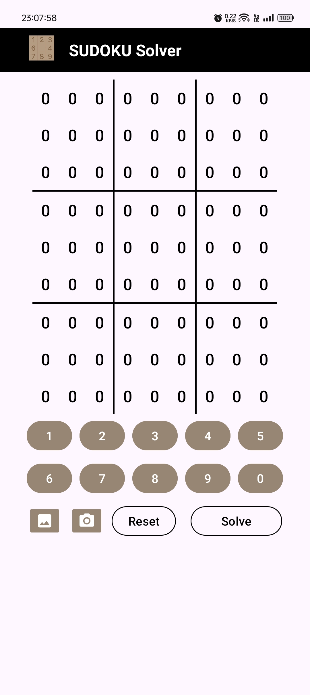

# GenAI Sudoku Solver App

The **GenAI Sudoku Solver App** is a sleek, efficient Android app designed to help users solve Sudoku puzzles. It comes with dynamic themes, real-time error handling, Gemini-powered image recognition, and an intuitive interface. Whether you are a Sudoku beginner or an enthusiast, this app simplifies puzzle-solving with its powerful backtracking algorithm and camera-based input.


## Table of Contents

- [Features](#features)
- [Screenshots](#screenshots)
- [Technologies Used](#technologies-used)
- [Installation](#installation)
- [Usage](#usage)
  - [Main Screen](#main-screen)
  - [Theme Support](#theme-support)
  - [Gemini Photo Solver](#gemini-photo-solver)
- [Error Handling](#error-handling)
- [Contributing](#contributing)
- [License](#license)
- [References](#references)
- [Author](#author)


## Features

- **Gemini Image Recognition:** Capture a Sudoku puzzle using your device’s camera or choose an image from the gallery. The app uses Google Gemini API to detect and extract digits from the image automatically.
- **Theme Support**: Supports both light and dark themes, offering a seamless user experience.
- **Error Handling**: Detects and notifies about invalid grid configurations like conflicting numbers.
- **Real-Time Puzzle Solver**: Solves the Sudoku puzzle instantly with the press of a button.
- **Dynamic Number Input**: Allows users to input numbers easily via on-screen buttons.
- **Grid Reset**: The grid can be reset to its default state for new puzzles.
- **Highlighting**: Highlights selected cells to ensure clarity when inputting numbers.

---

## Screenshots

Here are some visuals showcasing the app's features:

1. **Light Theme Main Screen**  
<p align="center">
  
  
</p>

2. **Dark Theme Main Screen**  
<p align="center">
  
  
</p>

3. **Gemini Image Recognition**  
<p align="center">
  
  
</p>

---

## Technologies Used

- **Java**
- **Android SDK**
- **Android Studio**
- **Google Gemini API**

---

## Installation

Follow these steps to install and run the Sudoku Solver App:

1. Clone this repository:  
   ```bash
   git clone https://github.com/Abhishek-2502/GenAI_Sudoku_Classic
   ```

2. Open the project in **Android Studio**.

3. Create a file local.properties (Sudoku_Classic_With_Camera/Sudoku Classic with Camera) and add following:
   ```bash
   sdk.dir=C\:\\Users\\your_username\\AppData\\Local\\Android\\Sdk
   GEMINI_KEY=your_api_key
   GEMINI_MODEL=gemini-2.5-flash-lite-preview-06-17
   GEMINI_URL=https://generativelanguage.googleapis.com/v1beta/models/
   ```

4. Connect your Android device or use an emulator.

5. Build and run the app on your device.

---

## Usage

### Main Screen

- Tap on any cell in the 9x9 grid to select it.
- Use the number buttons (1-9) below the grid to input digits.
- Press **Reset** to clear the grid and start fresh.
- Press **Submit** to solve the puzzle. If the grid is unsolvable or invalid, the app will display an error message.

### Theme Support

- The app automatically switches between **Light** and **Dark** modes depending on the system's theme settings. This improves user experience and reduces eye strain.

### Gemini Photo Solver

- Tap the Camera or Gallery icon on the home screen.

- Capture or select an image containing a Sudoku puzzle.

- The app sends the image to the Gemini Vision API, which detects the Sudoku grid, extracts the digits, and auto-fills them into the grid.

- Press Submit to solve the recognized puzzle instantly.

This feature combines AI-powered image understanding and Sudoku solving algorithms for an effortless experience.

---

## Contributing

We welcome contributions to improve this app! Feel free to submit pull requests or raise issues for bugs, features, or enhancements.

---

## License

This project is licensed under the MIT License - see the [LICENSE](LICENSE) file for details.

---

## References

- https://www.youtube.com/@programming_hut/videos
- https://github.com/Pawandeep-prog/cat-dog-android-app


---

## Author

Abhishek Rajput
